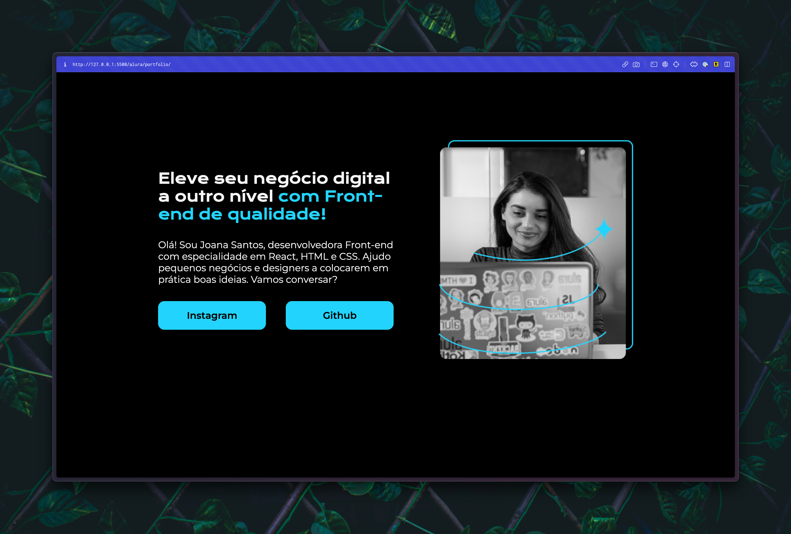

# Portfólio

Esse projeto implementa um portfólio de um profissional front-end, criado do zero com HTML e CSS. Esse desenvolvimento é com base nos [cursos de front-end da Alura](https://cursos.alura.com.br/formacao-html-css).

## Imagem das Páginas

1. Home

2. Sobre mim

